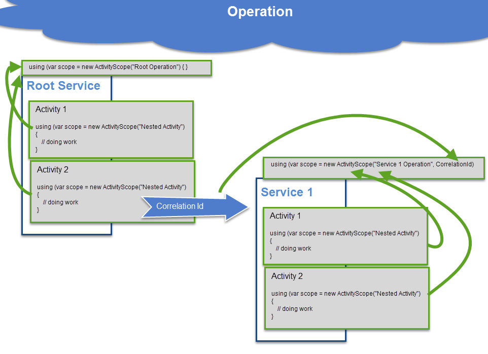

## CorrelatorSharp - what is it?

CorrelatorSharp enables context-aware logging and correlation tracking between multiple services and operations. CorrelatorSharp **is async/await safe** and **the current activity flows logically across tasks and threads**.

Supported "service" frameworks for automatic correlation (using a `X-Correlation-Id` HTTP header):

* ASP.NET MVC 5
* ASP.NET Web API
* RestSharp

Supported logging frameworks for correlation activity information logging and persistence:

* NLog
* Application Insights


```C#
using (ActivityScope scope = new ActivityScope("Operation")) {
		Console.WriteLine("Current Activity Id: " + ActivityScope.Current.Id);
	    Console.WriteLine("Current Activity Name: " + ActivityScope.Current.Name);
	    Console.WriteLine("Current Activity ParentId: " + ActivityScope.Current.ParentId);

	using (ActivityScope nestedScope = new ActivityScope("Nested Operation")) {
	    Console.WriteLine("Current Activity Id: " + ActivityScope.Current.Id);
	    Console.WriteLine("Current Activity Name: " + ActivityScope.Current.Name);
	    Console.WriteLine("Current Activity ParentId: " + ActivityScope.Current.ParentId);
    }
}
```

Output:

```C#
Current Activity Id: 4050a075-51db-4e62-8a92-17720a73045e
Current Activity Name: Operation
Current Activity ParentId:

Current Activity Id: 2d7aa66d-62b4-406d-91e4-ea3305690675
Current Activity Name: Nested Operation
Current Activity ParentId: 4050a075-51db-4e62-8a92-17720a73045e
```



## Get it

|   NuGet Package                     |   Description                                                                     |
|-------------------------------------|-----------------------------------------------------------------------------------|
| CorrelatorSharp                     | Activity context tracking (`ActivityScope`) |
| CorrelatorSharp.ApplicationInsights | Automatic injection of correlation and activity information into the Applicatio Insights telemetry data. |
| CorrelatorSharp.Logging.NLog        | NLog logging and layout renderers |
| CorrelatorSharp.Mvc5                | Automatic correlation and activity initialization and scoping for MVC 5 |
| CorrelatorSharp.WebApi              | Automatic correlation and activity initialization and scoping for Web Api |
| CorrelatorSharp.RestSharp           | Correlation HTTP header injection into RestSharp requests  |
| CorrelatorSharp.Logging             | Logging adaptor/wrapper for logging frameworks that do not support injecting logging data (e.g. NLog) |

### Continuous Integration

|   Branch    |   Usage       |   Status   |
|-------------|---------------|------------|
| master      | development   | [](https://ci.appveyor.com/project/ivanz/correlatorsharp/branch/master)  |
| release     | released code | [](https://ci.appveyor.com/project/ivanz/correlatorsharp/branch/release)  |


### Standalone

Creating a new activity scope:

```C#
using CorrelatorSharp;

using (ActivityScope scope = new ActivityScope("Main Operation")) {
    DoWork();
}

```

Getting the current activity scope:

```C#
ActivityScope.Current.Id
ActivityScope.Current.Name
ActivityScope.Current.ParentId
```

Creating a nested activity scope:


```C#
using CorrelatorSharp;

using (ActivityScope scope = new ActivityScope("Main Operation")) {
    DoWork();

	using (ActivityScope scope = new ActivityScope("Nested Operation")) {
	    DoMoreWork();
	}
}

```

### ASP.NET MVC 5 and Web API

*MVC 5 Example:* https://github.com/ivanz/CorrelatorSharp/tree/release/CorrelatorSharp.Mvc5.Sample
*Web API Example:* https://github.com/ivanz/CorrelatorSharp/tree/release/CorrelatorSharp.WebApi.Sample


Both integrations will automatically set-up the current `ActivityScope` based on either a `X-Correlation-Id` http header in the request or a new random activity id. They will also inject a `X-Correlation-Id` header into the response.

```C#
public ActionResult Test()
{
    return Json(ActivityScope.Current.Id);
}
```
```HTML
<script>
    $(function() {
        $("#sendRequest").on("click", function () {
            $.ajax({
				beforeSend: function (xhr) {
                    xhr.setRequestHeader('X-Correlation-Id', '1234');
                },
                url: encodeURI('/home/test'),
                type: 'POST',
                data: {},
                contentType: 'application/x-www-form-urlencoded',
                success: function (data) { alert("server responded with correlation id: " + data); },
                error: function () { },
            });
        });
    });
</script>

<div>
    <button id="sendRequest">Send Request with Correlation Id "1234"</button>
</div>
```

#### Enable in MVC 5

```C#
public class FilterConfig
{
    public static void RegisterGlobalFilters(GlobalFilterCollection filters)
    {
        filters.Add(new CorrelationIdActionFilter());
    }
}
```

### Enable in Web API

```C#
public static class WebApiConfig
{
    public static void Register(HttpConfiguration config)
    {
		config.Filters.Add(new CorrelationIdActionFilter());
    }
}
```


### RestSharp


```C#
RestRequest request;

request.AddCorrelationHeader();
```

This will add a `X-Correlation-Id` http header using either the current Activity Id or if there isn't a current activity - it will generate a random id.


### Application Insights

```C#
TelemetryConfiguration.Active.TelemetryInitializers.Add(
		new CorrelatorSharp.ApplicationInsights.OperationIdTelementryInitializer());
```

This will initialize the following properties in the Application Insights telemetry:

* Operation Id (built-in property)
* Operation Name (built-in property)
* `ParentOperationId`

**Note:** You need to remove the built-in Application Insights operation id telemetry initializer - otherwise they will overwrite each others properties.

### NLog

The NLog support consists of:

* Three layout renderers:
 *  `cs-activity-id`: current activity id
 *  `cs-activity-parentid`: current activity id
 *  `cs-activity-name`: current activity name
* Drop-in replacement for `ILogger` and `ILogManager` (namespace change required only)

To use the NLog component:

1. Install the CorrelatorSharp NLog package
2. Add `<add assembly="CorrelatorSharp.Logging.NLog"/>` to `<extensions>` in the NLog config
3. Adjust your target layout to use the above layout renderers
4. Replace `using NLog` with `using CorrelatorSharp.Logging`
5. Enable NLog in CorrelationSharp.Logging: `LoggingConfiguration.Current.UseNLog();`

#### Why is CorrelatorSharp.Logging needed?

Creating a log entry (`logger.LogTrace("asdf")`) and actually persisting it are separate operations which can execute in different contexts (threads or processes). We do need to capture the current activity info at the point of creating the log entry and unfortunately NLog doesn't expose a generic way to do that.

To workaround that limitation we wrap the NLog `ILogger` and `LogManager` in equivalent ones with additional instrumentation.


#### Example

*Example Project:* https://github.com/ivanz/CorrelatorSharp/tree/release/CorrelatorSharp.Logging.NLog


```C#
using CorrelatorSharp;
using CorrelatorSharp.Logging.NLog;

class Program
{
    private static ILogger _logger;

    static void Main(string[] args)
    {
        LoggingConfiguration.Current.UseNLog();

        _logger = LogManager.GetLogger("NLogSample");

        using (var scope = new ActivityScope("Operation")) {
            _logger.LogTrace("something happened");
        }
    }
}
```

#### NLog Configuration

```xml
<?xml version="1.0" encoding="utf-8" ?>
<nlog xmlns="http://www.nlog-project.org/schemas/NLog.xsd"
      xmlns:xsi="http://www.w3.org/2001/XMLSchema-instance"
      xsi:schemaLocation="http://www.nlog-project.org/schemas/NLog.xsd NLog.xsd"
      autoReload="true"
      throwExceptions="false"
      internalLogLevel="Off" internalLogFile="c:\temp\nlog-internal.log" >


  <extensions>
    <add assembly="CorrelatorSharp.Logging.NLog"/>
  </extensions>

  <targets>
    <target name="file" xsi:type="File" fileName="log.txt" 
            layout="[activity: ${cs-activity-id}] [parent: ${cs-activity-parentid}] [activity name: ${cs-activity-name}] ${message}"/>
  </targets>

  <rules>
    <logger name="*" minlevel="Trace" writeTo="file" />
  </rules>
</nlog>
```

This results in output like this:

```
[activity: 12baa714-384b-4236-a47c-7acfd9464500] [parent: ] [activity name: Main Operation] preparing to do work
[activity: 12baa714-384b-4236-a47c-7acfd9464500] [parent: ] [activity name: Main Operation] doing work
[activity: 09d4359a-d191-4bd7-bd68-adafcb23133a] [parent: 12baa714-384b-4236-a47c-7acfd9464500] [activity name: Nested Operation 1] done processing
[activity: 9ddb53d6-3ea0-44da-a7b8-96d911ecf6eb] [parent: 12baa714-384b-4236-a47c-7acfd9464500] [activity name: Nested Operation 2] done processing

```

## Extending CorrelatorSharp

### Adding support for to logging frameworks


#### Injecting telemetry/logging data

If the logging framework supports injecting additional data at log entry creation time then - look at the Application Insights integration code.

#### Wrapping `ILogger`

If the logging framework doesn't support injecting additional data - consider creating an addaptor for use with  `CorrelatorSharp.Logging` that wraps the `ILogger` of the logging library. Have a look at the NLog integration code.


### Adding support for other libraries

The easiest is to look at the existing integrations, such as MVC 5, Web API, RestSharp, etc. Some tips below.

Getting the current activity scope:

```C#
ActivityScope.Current.Id
ActivityScope.Current.Name
ActivityScope.Current.ParentId
```

Getting the name of the http correlation header:

```C#
CorrelatorSharp.Headers.CorrelationId
```

Creating a new scope:

```C#
using CorrelatorSharp;

using (ActivityScope scope = new ActivityScope("Main Operation")) {
    DoWork();
}

```